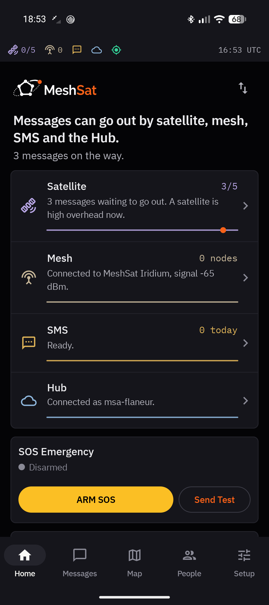
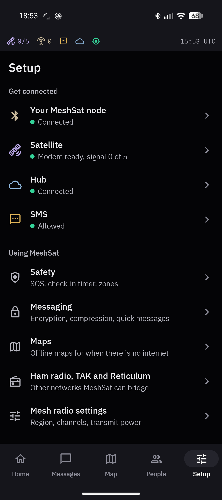
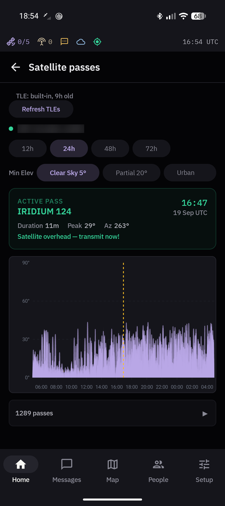
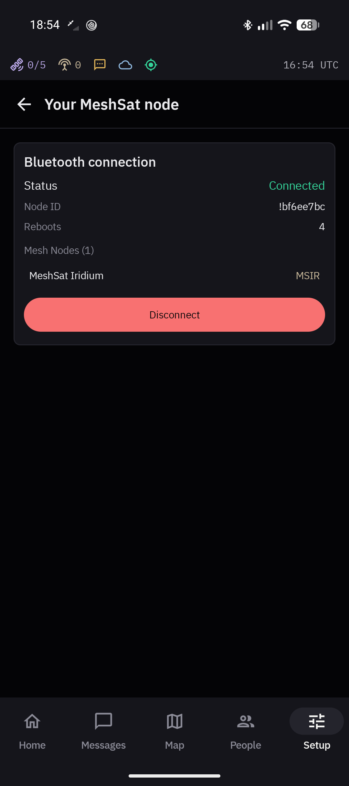
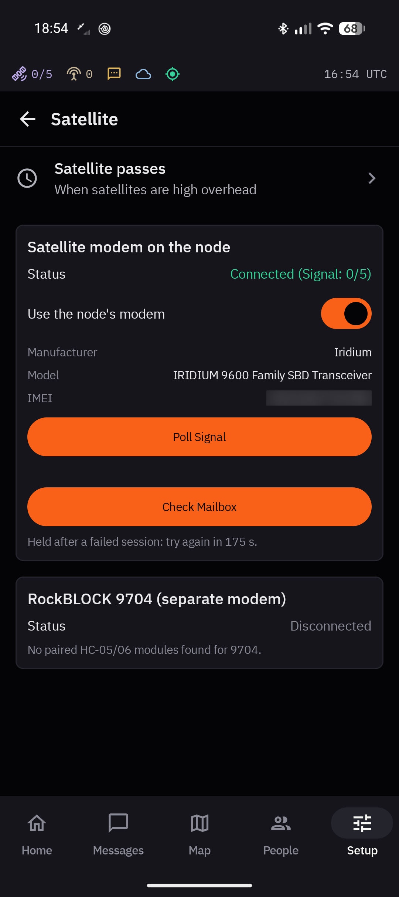
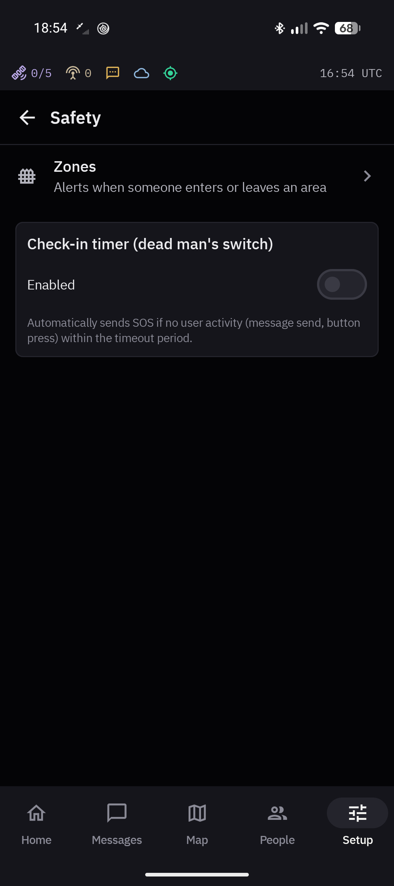

<div align="center">

<picture>
  <source media="(prefers-color-scheme: dark)" srcset="https://raw.githubusercontent.com/meshsat/meshsat/main/docs/images/mark-dark.png">
  
</picture>

### An Android phone as a MeshSat gateway: mesh, satellite and SMS in one app.

[](LICENSE)
[](https://github.com/meshsat/meshsat-android/releases/latest)


[Download](https://github.com/meshsat/meshsat-android/releases/latest) ·
[Docs](https://docs.meshsat.net/android/) ·
[MeshSat node](https://docs.meshsat.net/node/) ·
[What works](#what-works-and-what-does-not) ·
[meshsat.net](https://meshsat.net)

<table>
  <tr>
    <td width="33%"></td>
    <td width="33%"></td>
    <td width="33%"></td>
  </tr>
  <tr>
    <td align="center"><sub><b>Home</b>: every way out on one screen, and your messages on their way</sub></td>
    <td align="center"><sub><b>Setup</b>: node, satellite, Hub and SMS, each with where it stands</sub></td>
    <td align="center"><sub><b>Satellite passes</b>: computed on the phone, no internet needed</sub></td>
  </tr>
  <tr>
    <td width="33%"></td>
    <td width="33%"></td>
    <td width="33%"></td>
  </tr>
  <tr>
    <td align="center"><sub><b>Your MeshSat node</b>: its LoRa radio and Iridium modem over one Bluetooth link</sub></td>
    <td align="center"><sub><b>Satellite</b>: the node's modem, signal and mailbox</sub></td>
    <td align="center"><sub><b>Safety</b>: zones and the check-in timer</sub></td>
  </tr>
</table>

<sub>MeshSat Android 2.11 on a Pixel 9a, connected to a <a href="https://docs.meshsat.net/node/">MeshSat node</a> and the Hub, 19 September 2026. Real data, with the modem's IMEI and the phone's position blurred.</sub>

</div>

MeshSat Android turns an ordinary Android phone into a MeshSat gateway. Pair it with a [MeshSat node](https://docs.meshsat.net/node/), a pocket-sized box with a Meshtastic LoRa radio and a RockBLOCK 9603 Iridium modem, and one phone can send and receive over the mesh, by satellite and by SMS. It reports to the [MeshSat Hub](https://hub.meshsat.net) whenever there is any link to it, and it keeps working when the mobile network and the internet are gone.

It also works with any plain Meshtastic radio, for the mesh only.

> **Status: pre-release.** This is a prototype under active development, not a finished product. It has never been deployed to a real user and has never been used in an actual emergency. See [What works, and what does not](#what-works-and-what-does-not) before you rely on it for anything.

## Install

1. Download the APK from the [latest release](https://github.com/meshsat/meshsat-android/releases/latest).
2. Let your browser or file manager install unknown apps. Android asks the first time.
3. Open the APK and tap **Install**. Play Protect may warn about an unknown developer, because the app is not on the Play Store: tap **More details**, then **Install anyway**. The APK is signed, and you can [check the signature](#release-signing) first.
4. Open MeshSat and allow Bluetooth, location, SMS and notifications. Android needs location for Bluetooth scanning.

You need Android 8.0 or later.

**Coming from 2.8 or older?** Since 2.9.0 the app is `net.meshsat.android` (it was `com.cubeos.meshsat`), so Android installs it as a separate app and nothing carries over. Uninstall the old one, install the new one, and provision it with the Hub again by QR code.

## Getting started

1. **Pair your node.** In Setup, open **Your MeshSat node**, tap **Scan for Meshtastic devices**, then **Connect** next to your node and enter its Bluetooth PIN. The scan lists every Meshtastic device in range, so pick the node by its name (a v0 node advertises as `MSIR_` plus four hex digits). A plain Meshtastic radio pairs the same way.
2. **Satellite.** With **Use the node's modem** on (the default), the app uses the node's RockBLOCK while it is connected. Setup > Satellite shows the modem, with **Poll Signal** and **Check Mailbox**. After a restart the app reconnects to the same node and takes the modem back by itself.
3. **Hub (optional).** Setup > Hub > **Scan Hub Provision QR**, with the QR code from the Hub. That sets the Hub address, credentials and client certificate.
4. **SMS.** In Setup > SMS, tap **Allow SMS** and fill in the **Kit phone number**. SOS texts go to that number too.
5. **Send something.** Write a message in Messages. Home shows each way out: a solid line works, a dotted line is not available, and an orange dot is a message on its way.

Routing rules (Setup > Advanced > Routing rules) decide what is forwarded between links automatically, for example mesh messages out by satellite.

## What it does

- **Mesh.** Meshtastic over Bluetooth LE with the official protobufs: text, positions, telemetry, waypoints, node info, traceroute and more. Region, channels and transmit power are under Setup > Mesh radio settings.
- **Satellite.** Iridium SBD through the node's RockBLOCK 9603, up to 340 bytes out and 270 bytes in. Messages wait in a queue and are retried until they go out. The app opens a satellite session only when there is something to send, when the modem rings, or when you tap Check Mailbox. It never checks on a timer, because every session costs a credit. Passes are predicted on the phone from orbit data that ships with the app and is refreshed when there is internet, and the signal shows as an icon in Android's status bar.
- **RockBLOCK 9704 (Iridium IMT)** over an HC-05/06 Bluetooth serial adapter, with messages up to 100 KB. The code is there; it has not been tested on hardware.
- **SMS** through the phone's own SIM, optionally encrypted per conversation with AES-256-GCM. Mesh and SMS messages are compressed with MSVQ-SC by default. It is lossy: what arrives means the same, but may not be word for word what was sent.
- **APRS** through a KISS TNC over TCP (Direwolf, for example) or directly to APRS-IS, with smart beaconing and acknowledged messages.
- **Hub.** MQTT with a client certificate. The phone shows up in the Hub's fleet like a field kit, reports health and positions, and takes remote commands: send a message, flush the queue, update config, rotate keys, reboot. When a field kit cannot be reached directly, the app can reach it through a tunnel via the Hub.
- **TAK.** Positions from the Hub's TAK feed appear on the map. Receive only.
- **Reticulum.** The phone runs as a Reticulum transport node and relays between the mesh, both Iridium modems, MQTT and TCP peers.
- **Safety.** SOS sends three alerts 30 seconds apart: over the mesh, by satellite if the modem is connected at that moment, and by SMS to your kit's number. A check-in timer sends SOS if the phone sees no activity for too long, and zones alert you when someone enters or leaves an area.
- **Records.** A message queue with everything waiting, sent or given up; an audit log signed as an Ed25519 hash chain; and config export and import in YAML or JSON, in the same format as the Bridge.
- **Local API** on 127.0.0.1:6051, for testing and automation.

The gateway runs as a foreground service, so the phone keeps relaying with the screen off.

## What works, and what does not

| | State |
|---|---|
| Mesh through a MeshSat node over Bluetooth | Verified 19 September 2026 on a Pixel 9a |
| Satellite messages out through the node, landing at the Hub | Verified 19 September 2026, three messages |
| A satellite message in, picked up after a ring alert | Verified 19 September 2026 |
| Reconnecting to the node and taking its modem back after an app restart | Verified 19 September 2026 |
| Pass prediction with no internet | Verified 19 September 2026 |
| The phone connected to the Hub as a bridge | Verified 19 September 2026 |
| Recovery when the node drops out mid-session | Same code as a restart, **not exercised yet** |
| RockBLOCK 9704 | **Not tested on hardware** |
| SOS rework: hold to send, an emergency contact list, retries | **In progress.** Today's SOS works as described above |
| Deployment to a real end user | **Never** |
| Use in an actual emergency | **Never** |

## Hardware

| Kind | Device | Connection | Status |
|---|---|---|---|
| Phone | Google Pixel 9a, Android 17 | | Main test phone |
| Phone | Android emulator, API 30 | | Build checks |
| MeshSat node | v0: XIAO ESP32-S3, Wio-SX1262, RockBLOCK 9603 | Bluetooth LE | Tested, mesh and satellite |
| MeshSat node | v1: LILYGO T-Beam Supreme, RockBLOCK 9603 | Bluetooth LE | Being built |
| Meshtastic radio | Any Meshtastic device, for example a LILYGO T-Echo or T-Deck, a Heltec LoRa V4 or a XIAO ESP32-S3 with an SX1262 | Bluetooth LE | Should work, mesh only |
| Satellite | RockBLOCK 9704 | HC-05/06 Bluetooth serial | Not tested |
| APRS | Any KISS TNC reachable over TCP, for example Direwolf with a Quansheng UV-K5 and an AIOC | KISS over TCP | Should work |

Other phones with Android 8.0 or later should work, since the app only uses the standard Bluetooth, SMS and location APIs. If you try one, an issue with the result is welcome.

## Build from source

You need JDK 17 and the Android SDK (compile SDK 35).

```bash
git clone https://github.com/meshsat/meshsat-android.git
cd meshsat-android
./gradlew assembleDebug        # app/build/outputs/apk/debug/app-debug.apk
./gradlew testDebugUnitTest    # JVM unit tests, no device needed
```

It is Kotlin 2.1 and Jetpack Compose, with Room for storage, ONNX Runtime for the compression model, osmdroid for maps, Eclipse Paho for MQTT, BouncyCastle for Ed25519 and X25519, and NanoHTTPD for the local API. Library versions are in `app/build.gradle.kts`.

## Release signing

Releases are built and signed in CI, with the signing key held in OpenBao, and published on the Releases page. To check an APK before you install it:

```bash
apksigner verify --print-certs meshsat-android-2.11.1-release.apk
```

Every release since 2.8.0 shows:

```
Signer #1 certificate DN: CN=MeshSat, OU=CubeOS, O=Nuclear Lighters, L=Leiden, ST=South Holland, C=NL
Signer #1 certificate SHA-256 digest: 8ca78b6c33bd9796bb05f40fec2a0ab801e0297e7565960d42f5e6af821c9f66
Signer #1 certificate SHA-1 digest:   9040570a7bf4d33890bf82ad85a7debf24fa57ab
```

All releases use the same key, so a new version installs over the old one. The one exception is the 2.9.0 rename described under [Install](#install). Debug builds are signed with the Android debug key.

## Troubleshooting

**The scan does not find my radio.** Location must be allowed, Bluetooth must be on, and the radio must not be connected to another phone.

**The app stops in the background.** Some phone makers kill background services. Set MeshSat's battery use to Unrestricted, and see [dontkillmyapp.com](https://dontkillmyapp.com) for your brand.

**The satellite shows 0 bars.** That is normal between passes and under a limited view of the sky. The app sends anyway and keeps retrying, so a message can wait a while. Setup > Advanced > Message queue shows what is waiting.

**A message shows a clock.** It is queued and goes out by itself when it can. A tick means sent, red means it failed.

**The map is blank.** Online tiles need internet. For offline use, import an MBTiles file under Setup > Maps.

**"App not installed".** Usually a signature mismatch with a copy that is already installed, or the old `com.cubeos.meshsat` app from before 2.9. Uninstall it first.

## Related projects

- [MeshSat](https://github.com/meshsat/meshsat), the Bridge: the same gateway on a Raspberry Pi
- [MeshSat node](https://github.com/meshsat/meshsat-esp32) and its firmware, [meshsat-firmware](https://github.com/meshsat/meshsat-firmware)
- [MeshSat Hub](https://hub.meshsat.net), fleet management
- [Documentation](https://docs.meshsat.net/android/) and the [changelog](https://meshsat.net/changelog/android/)

## Contributing

Issues and pull requests are welcome. Run `./gradlew testDebugUnitTest` before you open a pull request, and open an issue first for anything large. Report security problems privately to security@meshsat.net rather than in a public issue; see [meshsat.net/security](https://meshsat.net/security/).

## License

Copyright 2026 Elli and Kyriakos. [GNU General Public License v3.0](LICENSE).

The app is GPLv3 because it includes the Meshtastic protobuf definitions in `app/src/main/proto/meshtastic/`, which are GPL-3.0. Third-party material and its licences are listed in [THIRD_PARTY_NOTICES.md](THIRD_PARTY_NOTICES.md) and [NOTICE](NOTICE).
